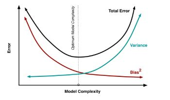

# Regularized-Linear-regression

Goal: To find the Weight matrix and use the weight matrix to perform prediction on test data.
w = (λI + ΦTΦ)⁻¹ * ΦT.t
Λ -> regularization parameter
ti_hat = WT*φ(xi)

MSE = 1/N ∑(ti − ti_hat)² 

The training set error is the lower bound and is always increasing. It has no minima.
The effect of λ: In the above figure it can be seen that when no regularization parameter is used or the parameter is small it overfits the data.

In the case of no regularization, we try to fit our loss and end up overfitting. Using a regularization parameter allows fitting the data with the least error. 
Although if the value of λ is too high we underfit our data

The effect of lambda on test set error depends on the value of the lambda:
Too small: we observe poor results as the error is high
Just right: we observe great results as the error is min
Too large: again the error increases
